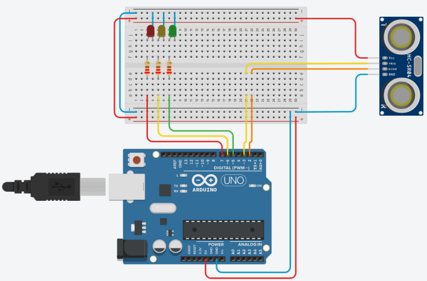

# Bakalářská práce

## Název práce:

Model křižovatky řízený Arduinem

## Autor:

Pavel Podrazký

## Pracoviště:

Katedra elektrotechniky a automatizace, TF, ČZU

## Vedoucí práce:

doc. Ing. Monika Hromasová Ph.D.

## Metodika:

- Rešerše hardwarových a softwarových řešení
- Návrh provedení výukové úlohy
- Realizace výukové úlohy
- Vytvoření programu pro řízení
- Realizace 3D tisku v prototypovém centru TF

## Zprovoznění projektu:

1. Stáhněte si projekt z repozitáře
2. Otevřete projekt v programu Arduino IDE
3. Stáhněte si knihovny pro Arduino (WIFININA, Adafruit_MQTT)
4. Zapojte Arduino podle schématu
5. Nahrajte program do Arduina
6. Spusťte Arduino

## Schéma zapojení:

