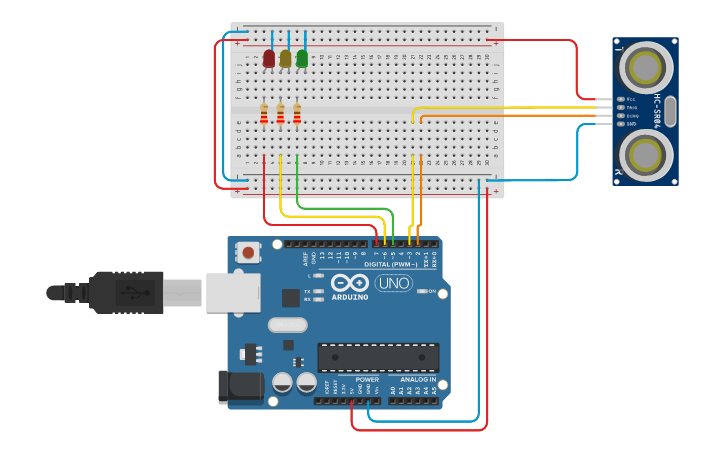

# Set up

Zde se dozvíte, jak si nainstalovat a spustit program.

## Prekvizity

Je potřeba vlastit desku Arduino, která obsahuje WiFi modul, případně je možné použít WiFi shield. Dále je potřeba mít nainstalovaný Arduino IDE, který je dostupný na [oficiálních stránkách](https://www.arduino.cc/en/Main/Software).

Dále je potřeba mít připravený senosr HC-SR04, který bude měřit vzdálenost a 3 LED diody.

### Potřebné knihovny

Pro správnou funkčnost je potřeba mít nainstalované následující knihovny:

- [WiFiNINA](https://www.arduinolibraries.info/libraries/wi-fi-nina) - pro komunikaci přes WiFi
- [ArduinoMqttClient](https://www.arduinolibraries.info/libraries/arduino-mqtt-client) - pro komunikaci přes MQTT

Knihovny se dají naistalovat přes Arduino IDE v záložce `Nástroje -> Správce knihoven`.

## Zapojení



## Nastavení

Je potřeba vytvořit složku config a v ní vytvořit následující soubrory:

- `APIConfig.h` - obsahuje nastavení pro API

```c
#ifndef APIConfig_h
#define APIConfig_h

// URL adresa API serveru
#define SERVER_ADDRESS "adresa.serveru.com"
// adresa testovacího serveru na lokální síti
#define LOCAL_SERVER       \
    {                      \
        192, 168, 132, 103 \
    }
// port serveru
#define SERVER_PORT 8000

#endif
```

- `WiFiConfig.h` - obsahuje nastavení pro WiFi

```c
#ifndef WiFiConfig_h
#define WiFiConfig_h

// SSID WiFi sítě
#define WIFI_SSID "SSID"
// heslo WiFi sítě
#define WIFI_PASSWORD "heslo"

#endif
```

- `MQTTConfig.h` - obsahuje nastavení pro MQTT

```c
#ifndef MQTTConfig_h
#define MQTTConfig_h

// adresa MQTT serveru
#define MQTT_SERVER "adresa.serveru.com"
// port MQTT serveru
#define MQTT_PORT 1883
#define MQTT_TOPIC "topic"
#endif
```

- `SensorConfig.h` - obsahuje nastavení pro senzor

```c
#ifndef SensorConfig_h
#define SensorConfig_h

// pin připojený na Trig
#define TRIGGER 2
// pin připojený na Echo
#define ECHO 3
// doba po kterou se bude vysíal ultrazvukový signál
#define MESUREMENT_TIME 5
// minimální výška při které se Arduino zareaguje
#define TRIGGER_OFFSET_MIN 1
// maximální výška při které se Arduino zareaguje
#define TRIGGER_OFFSET_MAX 7

#endif
```

- `LEDsconfig.h` - obsahuje nastavení pro LED diody

```c
#ifndef LEDsConfig_h
#define LEDsConfig_h

// PIN zelené diody
#define ZELENA 5
// PIN oranžové diody
#define ORANZOVA 6
// PIN červwné diody
#define CERVENA 7

// jak dlouho má červená dioda svítit
#define CERVENA_INTERVAL 3000
// jak dlouho má svítit červená a oranžová dioda zároveň
#define CERVENA_ORANZOVA_INTERVAL 1000
// jak dlouho má oranžová dioda svítit
#define ORANZOVA_INTERVAL 1000
// jak dlouho má zelená dioda svítit
#define ZELENA_INTERVAL CERVENA_INTERVAL + CERVENA_ORANZOVA_INTERVAL

#endif
```

## Spuštění

Po zapojení a nastavení stačí program nahrát do Arduina a spustit.

# Očekávané chování

Arduino začne s kontrolní sekvencí, zda je vše v pořádku. Pokud je vše v pořádku, Arduino začne měřit vzdálenost. Pokud se při kontrole zjistí, že je něco špatně, Arduino začne blikat červenou diodou.

Po kontrole se bude opakovat tako LED sekvence:

- červená dioda svítí 3 sekundy
- červená a oranžová dioda svítí 1 sekundu
- zelená dioda svítí 4 sekundy
- oranžová dioda svítí 1 sekundu

Během blikání Arduino měří vzdálenost. Pokud sensor zaznamená pohyb odešle na MQTT server zprávu s tím, zda byl pohyb zaznamenán v momentě kdy svítila červená dioda.

Další zpracování probíhá na Flask serveru, který je dostupný v [tomto repozitáři](https://github.com/drillby/Bakalarska_prace/tree/backend).
